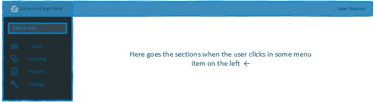
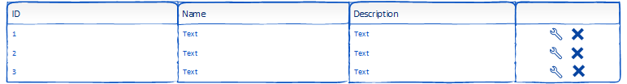

# SCOUTING APP SCREENS

<!-- Some suggestions are shown as comments, enjoy -->
_Important notes are shown in italic_.

_Html/Css id/class suggestions are shown in **bold**_.

_There are two apps actually, one for the users in general, and other for the administration purposes_.

## FUNCTIONAL REQUIREMENTS (only the main functionalities available on the screens) 

### Teams management: 

_The team management will be performed in the user side and the admin side. The user side will have the functionality of add and block team's members, and the admin side, of blocking teams_.

### Users management:

_The user management will be performed in the user side and the admin side. The user side will have the functionality for creating new users and editing profile settings. The admin side will have the functionality for deleting(disabling) users_.

### Period management:

_The period administration will be done through the admin side, adding and deleting periods_.

### Questions management:

_Questions and question types will be managed on the admin side_.
<!-- For future versions, questions could be managed by the users directly -->

### Evaluations management:

_Actions related to evaluations will be performed on the user side_.

### Reports:

_Reports will be shown in the user side_.

--- 

## USER SIDE

### LEFT SIDE MENU ITEMS **[nav #menu .menu]**

- Home _(The logo in the top left corner)_
- Search _(The search box after the home link)_
- Team **[.menu-link]**
- Scouting **[.menu-link]**
- Reports **[.menu-link]**
- Settings **[.menu-link]**

### HOME

The home screen must be able to show the main information about the user team and the team.

- User name
- User teams: _For example:_ [#9999](), [#8888]() **[links]**
- User situation (is master, is active, is not accepted as team member...)
- Login time
- Notifications
    - Your team master aproved you in the team #9999 **[.alert-green]**
    - You don't have any team yet, search for one! **[.alert-blue]**
    - Your account must be verified, send me the verirification link again **[.alert-yellow]**
    - There are new questions for scouting. **[.alert-blue]**
    - You didn't submit your evaluation yet. **[.alert-blue]**
    - No messages. _In case that there are any messages for the user_.

### DROP DOWN PANE USER

The drop down pane user menu will show some basic information about the user and the user accounts for switching purposes.

- User name <!-- - User photo --> <!-- - User description -->
- Edit : **[.user-btn]**
- Sign out **[.user-btn]** <!-- Maybe a new drop down menu for changing the team in the app can be more intuitive, but I think that is more simple in this way -->
- Teams _(if the user clicks on a team number, the active team in the app is changed to it)_: _For example:_ 
 - #9999 **[link]**
 - #8888 **[link]**

### SEARCH

**search**

_Basic search feature, will show in the right section the results._

_If the result is a user, show the name, and add a link to a modal that will show user's teams, if exists._

_If the result is a team, show the number, and add a link to a modal that will show the basic information about the team, and an option to be a part of the team (disable the option in case the user is already part of the team)_

_The most important feature is show the team results, and add the option to be a part of that team, because, for now, this is the only way the users will contact the team admin to be a part of it._

### TEAM

The team section must be able to show the main information about the team, and extra features when the respective user logged in is a team admin.

<!-- - A huge team photo -->
- _If the team is disabled, show a warning message_: Your team has no granted access anymore, the team members will not be able to submit evaluations, please contact the system admin. **[.alert-yellow]**
- Team number
- Team name
- Team admins
- Team created at <!-- - Team description -->
- Team members <!-- Click on team members and show the basic info about them may be a good feature --> **[.box .table]**  _For example:_ 
<!-- For instance, only the name and the email will shown in the table, but more data could be necessary -->
| Name      | Email             | _if the current user is a team admin:_                                |
|-----------|-------------------|-----------------------------------------------------------------------|
| Newton    | newton@newton.com |  **[.btn .btn-small .btn-red .tooltip]** _(button to block the user)_ |
| Tesla     | tesla@tesla.com   |  **[.btn .btn-small .btn-red .tooltip]** _(button to block the user)_ |

- Team evaluations: _[some counter here]_

_If the current user is a team admin:_

- Show a list with user requisitons to be a part of the team **[box table]**
_For example:_ <!-- For instance, only the name and the email will be shown in the table, but more data could be necessary -->

| Name      | Email             |                                                                                                                                                                 |
|-----------|-------------------|-----------------------------------------------------------------------------------------------------------------------------------------------------------------|
| Newton    | newton@newton.com |  **[.btn-blue .btn-small]** _(button to approve the user on the team)_ **[.btn .btn-small .btn-red .tooltip]** _(button to delete the requisition, trash icon)_ |
| Tesla     | tesla@tesla.com   |  **[.btn-blue .btn-small]** _(button to approve the user on the team)_ **[.btn .btn-small .btn-red .tooltip]** _(button to delete the requisition, trash icon)_ |

### Scouting

_This section must show the forms with the scouting questions obtained via API, the user must be allowed to complete the questions and submit the evaluation. That is, this screen depends of the information obtained via API, so organize the questions as necessary_.

### Reports

_This section must show reports about the evaluations, that is, the team members who evaluated other teams, the best robots, the best robots for each period, etc. It could be interesting if it is possible to filter information and show only the robots filtered (using comboboxes, for instance)_.

- Scaled phase, _For example:_

| Team's robot  | Did parking   | Climbed without levitate  | Climbed without help  | Helped other robots to climb  | Used Levitate | Tried to climb |
|---------------|---------------|---------------------------|-----------------------|-------------------------------|---------------|----------------|
| #9999         | Yes           | No                        | No                    | No                            | Yes           | Yes            |

- Autonomus period, _For example:_

| Team's robot  | Left through the middle   | Left Loaded   | Crossed the auto line | Switch control    | Scale control | Power ups control              |
|---------------|---------------------------|---------------|-----------------------|-------------------|---------------|--------------------------------|
| #9999         | No                        | Yes           | Yes                   | Yes               | No            | Moved 2 PU                     |
| #8888         | No                        | Yes           | Yes                   | Yes               | No            | Didn't tried to control any PU |        
- Teleoperated period, _For example:_

| Team's robot  | PUs placed in the alliance switch | PUs placed on the scale   | PUs placed on the opponent's switch   | PUs passed by the exchange    | PUs Dropped   | Robots blocked attempts   |
|---------------|-----------------------------------|---------------------------|---------------------------------------|-------------------------------|---------------|---------------------------|
| #9999         | 2                                 | 2                         | 5                                     | 3                             | 2             | 1                         |
- Team members who submitted evaluations, _For example:_

| Name  | Team's robot |
|-------|--------------|
| Isaac | #9999        | 
 
---

## ADMIN SIDE

_The same basic structure will be used, the behavior is analogous as the USER SIDE_.

_The tables might follow the following pattern, but with the **lite admin** theming:_

### HOME

_Display basic info, how many active users, teams..., display a list with blocked users, and a list with blocked teams_.

### SEARCH

_Search for users and teams, show the result, display a button to delete or block a team or user_.

### QUESTIONS

- Show table with questions, display button to delete and modify questions if necessary.
- Display a form to create a new question.
- Display a list with question types, show button to delete and modify question types if necessary.

### PERIOD

- Display periods of the system. Display button to delete and modify a period if necessary.
- Display a form to create a new period.